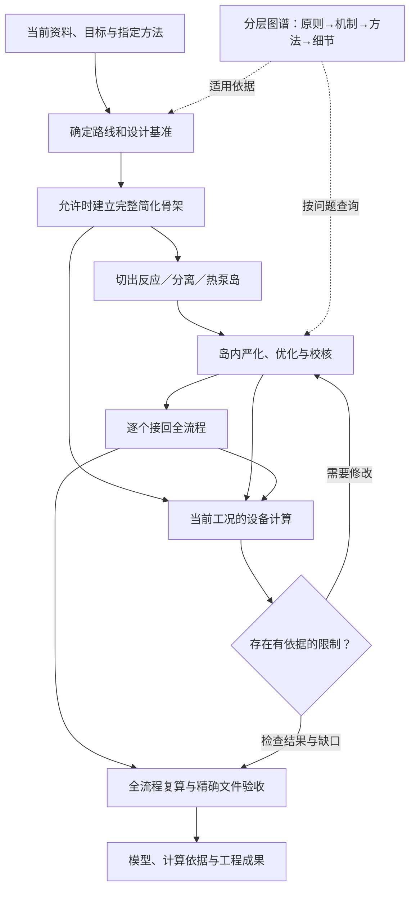

# 化工设计专家工作库

先按交付目标查[任务入口与协作图](plugins/chemical-engineering-skills/skills/chemical-engineering-expert/references/ACTIVE_ASSET_REGISTRY.md)，再进入有关专业；19 个模块按六类职责组织，详情按需读取。

这套Skill用于把化工设计要求逐步做成有依据的流程、模型和设备方案。你可以交给它
任务书、论文、参数表或已有Aspen模型，让它梳理工艺路线、建立完整流程、优化
反应与分离工段、检查热量和压力安排，再用设备计算反查方案能否实现。已有模型
也可以从当前进度继续修复和优化，不必重新搭建。

它既包含专业工作方法，也带有可离线查询的分层知识、设备规则与标准事实数据库、
计算脚本和本地接口，不需要另装其他RAG仓库或设备选型器。真实Aspen、EDR等
计算仍由目标电脑上合法安装的软件完成，Skill负责组织设计、调用工具和核验证据，
不是一句指令便能保证任何工厂设计成功的独立仿真软件。

## 能用来完成什么

从资料开始，可以整理设计基准、反应与分离依据，形成有完整物流去向的流程骨架，
再逐段建立严谨模型。对已有流程，可以定位报错、处理循环与控制问题，优化塔和
溶剂回收，评估预热、热回收及适用的蒸汽再压缩/热泵方案，并比较同等产量与质量下
的能耗和设备负担。

设备方面，可以由当前工况推导选型参数，检查换热器、压缩机、塔、泵、容器等的
适用条件，生成设备表和来源记录。设备能力不足时，结果会返回工艺设计，支持有
依据的分段、分级、并联或工况修改，而不是选到一个名称便结束。进一步的塔水力学、
EDR及机械设计交接由各自模块负责，达到什么证据等级就说明到什么程度。

成果可以包括模型与运行记录、计算账本、设备清单、动力学说明、流程图和报告修订。
费用模块可组织设备购置费分析，但部分费用数据、AEPA提取脚本和SW6映射仍需使用者
提供，具体见[模块说明](docs/模块说明.md)和[依赖范围](docs/外部依赖.md)。

## 拿到一份文本后，它怎样建立全流程

首先读懂目标和约束：用什么原料、要什么产品、处理多大规模，指定什么方法，哪些
数据已经确定。图谱在这里帮助检查流程顺序、物性与相态、组分去向、热量和压力是否
合理；项目参数则从当前资料提取或有据推导，不拿教材案例数值填空。

如果任务允许简化建模，就先用最简单但连接完整的模块搭出全流程，检查总衡算、
循环、产品和废物流，并为后续计算提供初值。然后从最新流程中切出反应、分离或
热泵岛，冻结入口，分别严化和优化。这样每次先解决一个明确的物理问题，再把
核验过的岛逐个换回原流程；接回后入口和循环若发生变化，还要重新计算。

设备检查贯穿这个过程。骨架有了初步负荷就开始筛查，岛内确定工况后进一步校核，
接回或改参数后再用新导出复核。比如换热面积超过有来源的单机限值，可以评估串联
分段；压缩压比受限，可以评估分级；塔的处理能力受限，可以评估并联。但查不到型号
不等于设备做不了，新增设备也必须重新计算热态、压降、功耗和系统影响。

最后回到全流程，检查产品、衡算、循环、控制、设备和公用工程是否一起成立，再对
实际交付文件复开运行并验收。局部收敛、设备初筛通过或脚本执行结束，都不能代替
这一步。

现有项目从当前阶段进入这条流程，不强制重走前面已经完成的工作。单塔设计、
一项公式核查或报告排版，也只调用相关部分。更完整的说明见
[从资料到全流程的工作原理](docs/全流程工作原理.md)。

## 怎样让模块真正用起来

### 调参时怎样选择计算工具

如果只是问“这个值是多少”，先读取当前模型结果，不改参数。若是“进料变了，
补料也要跟着变”，把有依据的计算关系放进 Calculator，并安排在使用该结果
的单元之前执行；一次性换算不必给模型加计算器。

调参前先分清研究问题、固定条件和需要联动的操作量。例如，固定回流观察压力
变化的影响，与保持产品要求不变寻找更省能的压力，是两个不同问题。后者每个
压力点都要重解必要的质量控制；前者不能擅自打开这些控制来改变研究问题。
已有可行基准时，先用当前物料关系给初值，再决定是否需要扫描。

需要研究范围和变化规律时，用原生 Sensitivity；需要找到达到指定指标的工况时，
用有效区间内的 Design Spec/Vary。多个连续参数一起调、还要守住产品要求并降低
能耗或费用时，先评估原生 Optimization。外层参数改变后，内层产品规格重新
求解，避免把不同纯度或产量的点放在一起比较。离散路线或设备台数可以外层编排，
但不能仅因变量多就退回外部逐点试跑。

分析结果会决定下一步：局部指标变好但产品或设备约束失败，就回查目标与下游；
可行点靠近失败边界，再针对原因细化。选定工况后恢复模型，保留分析定义和结果，
不把最后一个扫描点当成交付点。

这套判断有独立的 `solve_route` 入口，也接进设计阶段检查。它返回相关判断步骤、
工具选择和结果反馈提示，可记录固定控制或同目标比较的研究上下文；声明仍需
专业核对，不代表程序已理解或验证流程。实际建卡、运行和导出由操作模块
在合法安装的 Aspen 中完成。附带 MCP 的 `sensitivity` 是外部扫描辅助函数，
不是原生 Sensitivity；路由成功也不是模拟完成。完整触发与执行说明见
[内置工具使用时机](plugins/chemical-engineering-skills/skills/aspen-document-driven-flowsheet/references/aspen_builtin_solve_fit_tools.md)。

### 图谱和设备怎样配合

流程入口和各专业Skill都写明了调用时机。到了选路线、骨架出负荷、岛内设计、
接回、工况修改和交付阶段，阶段检查入口会实际执行知识查询及相应设备计算，
留下请求、响应和来源身份。缺少输入时保留已经算出的部分，并指出哪项判断
尚未闭合；不会仅因为返回了一个模块名，就记成已经完成检查。

这项接线通过同一个CLI或MCP调用已有后台，不新造一套设备算法，也不直接改动
Aspen模型。是否采用检索方法、设备清单是否完整、工艺修改是否合理及真实软件
是否通过，仍由专业工作流分别检查。规则与执行边界见
[设计阶段调用](plugins/chemical-engineering-skills/skills/chemical-engineering-expert/references/DESIGN_STAGE_ROUTING.md)。

## 使用过程中积累经验

从 0.4.6 起，19 个 Skill 的阶段收尾入口会要求主助手主动检查值得复用的新方法
或原则：先展示具体方法摘要、适用限制和投稿入口。跑通经验核对实际版本与执行
范围；思想原则先由使用者确认具体内容，再由助手审核。普通重复操作不凑经验，
使用者拒绝后不反复催促；已有有效公开授权时继续已授权准备，不重复询问。

愿意分享的使用者可按[中文投稿指南](https://github.com/milklong888/chemical-engineering-experience-inbox/blob/main/docs/USER_SUBMISSION_GUIDE.zh-CN.md)
提交脱敏候选 PR。首次公开须本人授权，安装 Skill 不会自动上传项目。临时收件
不直接改正式 Skill 或默认知识；详细规则见[经验提醒与收件](plugins/chemical-engineering-skills/skills/chemical-engineering-expert/references/EXPERIENCE_INBOX.md)。
这是对助手行为的工作指令，仍须用当前任务的可见操作核实是否执行；不是后台
采集服务。其他电脑须更新并重新安装本版本，单纯拉取源码不会更新已安装副本。

## 安装与文档

更新Skill时，可用[组织与影响索引](docs/skill_organization.md)查询文件引用和需要复核的模块，
用[观察索引](docs/observation_index.md)关联显式列出的运行证据。
两项工具保留未解析依赖、缺失和身份冲突，不自动批准规则更新或工程结果。
任务下一步不清楚时，按需参考[决策树](plugins/chemical-engineering-skills/skills/chemical-engineering-expert/references/TASK_DECISION_TREES.md)，
其中的专业规则仍由各自模块维护。

从[发行页](https://github.com/milklong888/chemical-engineering-skills/releases)下载完整离线包，
解压到较短的可写路径，按[使用手册](docs/使用手册.md)先校验再安装。随包依赖针对
Windows AMD64、CPython 3.14，目标电脑需已有该Python解释器；离线工具不下载模型。
本地计算能离线运行，不表示所用的云端AI模型也能离线对话。

资料和结果放在独立项目工作区。常规知识与设备计算不需要GUI，MCP只是可选调用方式；
实际商业软件操作需要相应安装和许可。新增资料经来源及适用性审查进入候选知识版本，
当前任务的经验可在证据和本人公开授权齐备后先进入临时收件流程；正式晋升为
共享原则或数据规律，仍须使用者发起整理并关闭相关任务修订，再走原有审核门。

- [使用手册](docs/使用手册.md)：环境、安装、项目准备及可执行示例。
- [模块说明](docs/模块说明.md)：19个模块各自怎样工作，何时交给下一个模块。
- [文件索引](docs/文件索引.md)：模块、脚本、图谱与数据的对应文件。
- [后台运行与计算说明](docs/后台运行与计算说明.md)：输入怎样计算，设备怎样反馈流程，压降怎样处理。
- [验证说明](docs/验证说明.md)：实际测试范围，以及软件测试与工程验收的区别。
- [源码与数据边界](docs/源码与数据边界.md)、[来源与许可](docs/来源与许可.md)：原资产、公开数据与第三方权利。

公开包不含教材扫描原件和整页OCR正文、私人项目模型与案例、商业软件或许可证。
待核和仅有身份记录的知识不冒充可用正文，标准事实也不自动成为当前设备的正式
设计条件。各项能力以实际文件、依赖和本版本验证记录为准。
