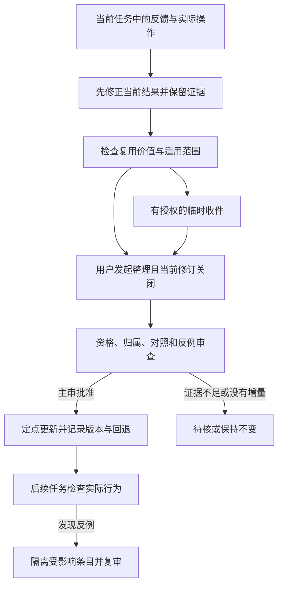

# Agent 怎样从一次任务中改进

本文介绍本库对 Agent 工作方式的持续改进：怎样选择工具、在不确定时查证、判断任务是否完成，以及维护可复用的行为规则。引用的论文用于解释这些机制；本文不展开具体领域知识，也不复述其他产品的 Skill 内容。

## 故事从两个不同的结果开始

在本库的一次 Luna 测试中，Agent 用中文查询没有命中，随后换用英文继续检索，并读取了具体条目。该题另有阶段检查未完成，整题仍记为部分通过。另一次采用合成场景的提醒测试中，Agent 正确理解了题设中的已有授权，也表示草稿已经准备，却没有展示草稿、具体提纲或文件。

两次响应都能写得流畅，实际完成程度却不同。前者留下了继续查证的行动，后者仍缺一个交付动作。这也是本库自进化机制关注的问题：哪些行为确实帮助完成了任务，哪些只停留在解释或承诺。

这里的“进化”发生在任务入口、提示规则、工具选择、经验条目和验证流程中。基础模型权重没有在这个过程中更新。规则能否带来更稳定的行为，要继续用实际任务检查。

## 第一步：把反馈变成下一步动作

[Reflexion（NeurIPS 2023）](https://papers.neurips.cc/paper_files/paper/2023/hash/1b44b878bb782e6954cd888628510e90-Abstract-Conference.html)研究了如何把任务反馈转为语言反思，保存在情节记忆中，供后续尝试使用。它让失败后的修正具有可带到下一次尝试的形式，而不依赖重新训练模型权重。

在本库中，反思首先要落到可观察的动作。检索没命中，可以检查查询词和资料范围；工具调用失败，应读取实际错误，区分能力缺失与环境阻断；宣布交付前，应核对结果文件和要求是否对应。每项判断都要能回答：依据来自哪次操作，随后改变了什么。

当用户指出问题，助手先修正当前任务并保留必要记录。单次失败、自信的解释或“下次注意”都不足以成为共享规则。重复发生的同类问题可以提高审查优先级，是否成立仍由证据决定。[现有记忆维护规则](../plugins/chemical-engineering-skills/skills/chemical-engineering-expert/references/MEMORY_MAINTENANCE.md)

## 第二步：从一次经历中提炼可以复用的条件

[ExpeL: LLM Agents Are Experiential Learners（v2）](https://arxiv.org/abs/2308.10144v2)把经验用于两类后续支持：从任务尝试中归纳自然语言经验，以及检索相关经历辅助新任务。它为“经历过一次”与“能在下一次使用”之间的整理过程提供了研究参照。

本库要求候选说明触发条件、应采取的动作、依据和不适用范围。例如，从一次检索补救中可以提出一条行为候选：初次查询无结果时，先检查术语和允许查询的资料范围，再决定是否确实缺少依据。它是否值得写入正式规则，还需检查已有入口是否已经规定了同样的行为，以及新规则会不会导致无关搜索。

经验在这里分两条路径处理。已执行的方法核对准确版本、相关运行和结果范围；思想原则先由使用者确认具体内容，再由助手审核同一内容的依据、冲突和边界。思想确认不能代替运行证据，也不应给已核验的执行经验额外套一遍思想确认程序。

可公开的候选在授权和脱敏检查齐全后，可以先进入临时收件流程。正式规则的整理则由用户发起，并要求相关任务的当前修订明确关闭。临时收件状态不改变活动知识，也不自动成为默认检索结果。[收件与正式整理的分工](../plugins/chemical-engineering-skills/skills/chemical-engineering-expert/references/EXPERIENCE_INBOX.md)

## 第三步：下次需要时，能够找到合适的经验

[Voyager（v2）](https://arxiv.org/abs/2305.16291v2)在 Minecraft 环境中将完成任务的程序逐步纳入技能库，并按新任务检索相关能力。本文关注其中“积累、索引、取用”的联系；论文中的自动课程和程序生成属于其特定系统设计。

对本库而言，经验应落到明确的位置。跨任务的行为原则保留在总入口或中央规则中；特定流程的操作方法放在相关模块；可以确定性执行的检查逻辑归入现有脚本。一个规则由一个明确位置负责维护，其他入口引用它，减少同一判断出现不同版本。

查询过程也要继续向下走：找到入口、读到必要内容、执行相应动作、检查实际产物，是不同的完成状态。前面那个换用英文继续查证的测试片段，支持的是该次探索行为；它不能证明所有未知问题都能被解决，更不能把一次命中扩展成知识覆盖率。

目前的任务登记、决策树和引用影响索引已经提供相应导航；选择是否适用、是否真正执行以及怎样解释结果，仍需要助手完成。[任务与资产登记](../plugins/chemical-engineering-skills/skills/chemical-engineering-expert/references/ACTIVE_ASSET_REGISTRY.md) · [维护工具](../plugins/chemical-engineering-skills/skills/chemical-engineering-expert/references/MAINTENANCE_TOOLS.md)

## 第四步：修改一条规则时，保住已经验证的部分

经验增多后，维护本身会成为问题。[ACE: Agentic Context Engineering（v1）](https://arxiv.org/abs/2510.04618v1)将生成、反思和整理分开，并采用条目化的局部更新与去重。论文讨论了反复整段重写上下文时，细节可能逐渐丢失的风险。

本库据此复核已有的局部维护方式：先查当前规则的负责位置，再决定保持不变、合并、细化、替换、新增或撤回。候选需要保留旧版与新版身份、影响范围和回退依据。没有明确增量时，可以不改；新反例出现时，先阻止受影响条目继续被采用，再复核适用范围。

这个过程保留主审。资格脚本检查条目能否进入相应审查；候选评估脚本检查声明的对照、反例、独立判据与回退材料，输出补证事项或待主审状态。脚本不会代替主审判断经验的技术真实性，也不会自行将条目写进正式规则。[正式晋升流程](../plugins/chemical-engineering-skills/skills/chemical-engineering-expert/references/EVOLUTION_LOOP.md) · [规则归属](../plugins/chemical-engineering-skills/skills/chemical-engineering-expert/references/CANONICAL_RULE_OWNERSHIP.md)

相关任务若曾放宽要求，其记录及派生仍留在项目审计范围内，不能通过改标题、摘要或版本编号进入共享经验。这个边界由本库的既有准入规则规定，不因引用某篇论文的失败学习方法而改变。

## 第五步：让测试判断改动是否做到了

本库已经在固定的 0.4.5 上完成 100 个独立 Luna 节点：50 个功能触发、25 个跨模块选择与纠错、25 个经验准入，逐题审核得到 **77 个完整通过、23 个部分通过**。它们帮助定位了工具状态解释、主动检索、规则归属核对和实际交付等问题。

这组测试在运行期间固定入口与工作区规则，通过最终回答、可见工具动作和产物审核。它是一次固定版本的行为检查，不是逐题自动更新后的学习曲线，也没有提供旧版与新版的可比收益结论。部分题目曾用于预运行，不能称为完全未见的独立留出集；准入题中的人物授权与治理材料是合成演练材料。

0.4.6 的提醒规则另用同一 8 题进行了三轮开发复测。这 8 题显式提供候选 Skill 入口，不验证隐式 Skill 发现。一次值得保留的修正发生在合成场景中：早先响应改写了题设中已确认的内容，后续规则要求保留确认原文、将审核意见另列；末轮对应响应做到了这一点。但“草稿已准备却未交出”的问题仍然存在，另有两题漏掉投稿链接。末轮因此记录为 **5 个完整通过、3 个部分通过**。

这段过程展示了发现缺口、改动规则、再查实际行为的维护路径。同题复测的结果不能作为未见任务上的泛化成绩，也不能把改动后的单次正确行为全部归因于某一条提示词。版本、范围与剩余问题见[0.4.6 发行记录](https://github.com/milklong888/chemical-engineering-skills/releases/tag/v0.4.6)。

## 现在已经具备什么

| 层面 | 已有内容 | 实际边界 |
|---|---|---|
| 助手行为规则 | 阶段提醒、主动查证要求、经验分类、去重与归属、版本和撤回处理 | 写入规则不保证每次完整执行，已有专项发现遗漏。 |
| 可运行的工具 | 任务路由、知识查询、引用影响与观察索引、资格与候选评估；独立收件仓库提供收件校验和 GitHub 检查观察 | 各工具只核查其声明的对象；Git 绿灯、哈希一致和校验通过不能互相代替。 |
| 实际观察 | 100 节点固定版本测试、8 题提醒开发复测，以及既有维护和收件工具检查 | 观察支持列明范围；没有证明跨用户持续自动学习、长期自进化收益或真实商业模型验收。 |

下一阶段若要量化“更会查、更会用、更少重复犯错”，需要在一致模型、材料、环境和预算下比较基线与候选，并用未参与修改的任务检查迁移效果。还应分开记录任务完成、错误泛化、不必要的工具调用、重复规则和回退表现。这是后续评估方向，当前不公布未经测试的提升比例。

流程图描述任务经验的正式整理。用户直接要求修改机制或规则，属于明确的维护任务，可按授权开展；它不会自动赋予其他任务的中间经验正式晋升资格。

## 论文与本库设计的对应

| 论文 | 本文采用的机制视角 | 本库的对应位置 |
|---|---|---|
| [Reflexion，NeurIPS 2023](https://papers.neurips.cc/paper_files/paper/2023/hash/1b44b878bb782e6954cd888628510e90-Abstract-Conference.html) | 任务反馈与后续行动之间的语言反思 | 外部证据支持的纠错、任务记录和行为候选。 |
| [ExpeL，2308.10144v2](https://arxiv.org/abs/2308.10144v2) | 从经历归纳经验，并检索相关经历 | 带触发与适用范围的经验整理。 |
| [Voyager，2305.16291v2](https://arxiv.org/abs/2305.16291v2) | 经过任务验证的能力积累与按需取用 | 明确任务入口、规则落点与调用检查。 |
| [ACE，2510.04618v1](https://arxiv.org/abs/2510.04618v1) | 生成、反思、整理分工与局部更新 | 小范围维护、去重、主审及版本回退记录。 |

论文贡献归其作者。这里记录机制上的参考关系和本库的实际落点，不表示复现了论文系统、训练方法或实验成绩。更细的采用范围见[研究机制与采用边界](../plugins/chemical-engineering-skills/skills/chemical-engineering-expert/references/SKILL_RESEARCH_APPLICATION.md)。
