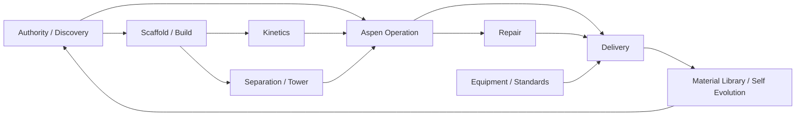

# Aspen Script Template Knowledge Graph

Use this graph when a project needs "one more script" and the agent is tempted
to copy an old project file. Pick the closest node, copy its base template into
the active project, then fill only project-local adapters, IDs, units, and
targets.

## Use Rules

- Search this file by trigger word, node ID, or cluster. Do not load old project
  scripts until the graph points to a reusable family.
- Nodes are template cards. Only files listed in `Base Template` are executable
  anchors; other nodes are project-local derivations from those anchors.
- Project values stay outside the generic skill. Put them in CLI args, JSON
  specs, local ledgers, or project material-library slices.
- Every promoted script must return evidence, a decision, and the next allowed
  action. Static checks never replace Aspen clean reopen/start-run proof.

## Graph Topology



No private tested cases are included. Nodes naming a project document parser
require a user-provided adapter; all other nodes are templates/patterns, not
proof that an operation has run. Learning candidates require explicit closure
of the current user task revision and qualified, unrelaxed lineage.

## Template Nodes

| Node | Cluster | Trigger | Base Template | Evidence | Next |
| --- | --- | --- | --- | --- | --- |
| AUTH-01 | authority | Need to crawl many project folders for reusable scripts | `project_script_inventory_template.py` | script inventory JSON/MD | LIB-02 |
| AUTH-02 | authority | Existing project, resume, or unclear current authority | `project_script_inventory_template.py` as locator pattern | authority-file index JSON/MD | AUTH-03 |
| AUTH-03 | authority | Need change-offset table before model mutation | derive from `delivery_gate_audit_template.py` | offset table presence/status report | BUILD-01 |
| AUTH-04 | authority | Need source-route extraction from reports | derive from local document reader plus project ledger | source route ledger | BUILD-01 |
| AUTH-05 | authority | Need current status digest after compaction | derive from `delivery_gate_audit_template.py` | status/audit/freeze digest | RUN-01 |
| AUTH-06 | authority | Old candidates may contaminate current branch | derive from `delivery_gate_audit_template.py` | stale-branch quarantine report | AUTH-05 |
| AUTH-07 | authority | Need source/taskbook completeness gate before Aspen mutation | `source_taskbook_gate_audit_template.py` | source gate JSON/MD with property freeze and user-adjustment rows | BUILD-01 |
| RUN-01 | operation | Need exclusive Aspen COM session | `aspen_com_lock_watchdog_template.py` | lock record and existing-process check | RUN-02 |
| RUN-02 | operation | Need open/export/no-run mechanical probe | `aspen_operation_template.py` | operation summary JSON | RUN-06 |
| RUN-03 | operation | Need discover Aspen tree paths | `aspen_operation_template.py` | tree path probe JSON/MD | RUN-04 |
| RUN-04 | operation | Need set card values with before/after audit | `aspen_operation_template.py` | node set audit JSON | RUN-06 |
| RUN-05 | operation | Need Control Panel or history capture | `control_panel_repair_loop_template.py` | first limiting message log | REPAIR-01 |
| RUN-06 | operation | Need block/status and stream CSV export | `aspen_operation_template.py` | block/status/stream files | DELIV-01 |
| RUN-07 | operation | Need clean reopen and start-run proof | `open_run_readiness_template.py` | readiness record | DELIV-03 |
| RUN-08 | operation | Need same-version export bundle | `aspen_operation_template.py` | `.inp/.bkp/.apwz/status` bundle | DELIV-02 |
| RUN-09 | operation | Need batch queue over many candidates | `aspen_candidate_matrix_template.py` | queue audit JSON | RUN-06 |
| BUILD-01 | build | Need source-led process skeleton | derive from `aspen_candidate_matrix_template.py` | skeleton manifest | BUILD-02 |
| BUILD-02 | build | Need component alias or CAS sanity probe | derive from `aspen_operation_template.py` | alias identity ledger | BUILD-03 |
| BUILD-03 | build | Need property-method probe | derive from `aspen_operation_template.py` | property probe report | BUILD-04 |
| BUILD-04 | build | Need yield/SEP scaffold | derive from `aspen_candidate_matrix_template.py` | scaffold sidecar and run evidence | BUILD-05 |
| BUILD-05 | build | Need split target ledger from scaffold | derive from `static_inp_audit_template.py` | split target ledger | BUILD-06 |
| BUILD-06 | build | Need recycle/makeup Calculator link | derive from `aspen_operation_template.py` | Calculator card export | BUILD-07 |
| BUILD-07 | build | Need Design Spec/Sensitivity setup | derive from `aspen_candidate_matrix_template.py` | bounds and solve/fit manifest | RUN-06 |
| BUILD-08 | build | Need pressure/HX stream-state audit | derive from `delivery_gate_audit_template.py` | pressure/HX audit JSON/MD | DELIV-02 |
| KIN-01 | kinetics | Need extract kinetic source table | derive from project document parser | source equation/value table | KIN-02 |
| KIN-02 | kinetics | Need source-unit to Aspen-card conversion | derive from `script_generalization_manifest_template.py` shape | unit conversion ledger | KIN-03 |
| KIN-03 | kinetics | Need kinetic microcase validation | derive from `aspen_operation_template.py` | microcase export and card echo | KIN-04 |
| KIN-04 | kinetics | Need PowerLaw card freeze | derive from `aspen_operation_template.py` | PowerLaw freeze audit | RUN-06 |
| KIN-05 | kinetics | Need LHHW card freeze | derive from `aspen_operation_template.py` | LHHW freeze audit | RUN-06 |
| KIN-06 | kinetics | Kinetics blocked; need provisional reactor route | derive from `delivery_gate_audit_template.py` | blocked/provisional reactor ledger | BUILD-04 |
| SEP-01 | separation | Need tower candidate matrix | `aspen_candidate_matrix_template.py` | tower candidate sidecars | SEP-02 |
| SEP-02 | separation | Need run tower matrix | `aspen_candidate_matrix_template.py` | queue audit and run summaries | SEP-04 |
| SEP-03 | separation | Need DSTWU/Rigorous tower bridge | derive from `aspen_candidate_matrix_template.py` | DSTWU-to-RadFrac sidecar | SEP-04 |
| SEP-04 | separation | Need RadFrac Required Input probe | derive from `open_run_readiness_template.py` | required-input diff | RUN-07 |
| SEP-05 | separation | Need tower pressure-drop audit | derive from `delivery_gate_audit_template.py` | tower pressure audit | BUILD-08 |
| SEP-06 | separation | Need solvent/entrainer recycle audit | derive from `delivery_gate_audit_template.py` | solvent closure report | BUILD-06 |
| SEP-07 | separation | Need flash train candidate generator | `aspen_candidate_matrix_template.py` | flash-train sidecars | RUN-09 |
| REPAIR-01 | repair | Need one-family Control Panel repair loop | `control_panel_repair_loop_template.py` | before/after first message | REPAIR-02 |
| REPAIR-02 | repair | Import/open failure needs bisect | derive from `aspen_candidate_matrix_template.py` | import-bisect ledger | RUN-02 |
| REPAIR-03 | repair | Need convergence trial queue | `aspen_candidate_matrix_template.py` | trial queue audit | REPAIR-04 |
| REPAIR-04 | repair | Need tear stream initialization probe | derive from `aspen_operation_template.py` | tear initial-estimate ledger | RUN-06 |
| REPAIR-05 | repair | Need detect forbidden precision changes | `static_inp_audit_template.py` | precision red-line audit | REPAIR-01 |
| REPAIR-06 | repair | Need detect over-tight specs/targets | derive from `delivery_gate_audit_template.py` | spec tightness report | BUILD-07 |
| REPAIR-07 | repair | Need property failure probe | derive from `aspen_operation_template.py` | property failure evidence | BUILD-03 |
| REPAIR-08 | repair | Missing Required Input after open | `open_run_readiness_template.py` | missing-input diff | RUN-04 |
| DELIV-01 | delivery | Need static exported-INP support audit | `static_inp_audit_template.py` | static audit JSON/MD | DELIV-02 |
| DELIV-02 | delivery | Need package hard-gate audit | `delivery_gate_audit_template.py` | delivery gate audit | RUN-07 |
| DELIV-03 | delivery | Need record open-run readiness | `open_run_readiness_template.py` | readiness record path | DELIV-04 |
| DELIV-04 | delivery | Need migrated-path portability proof | `path_migration_readiness_template.py` | migration readiness record | DELIV-05 |
| DELIV-05 | delivery | Need portable package manifest | derive from `delivery_gate_audit_template.py` | package manifest and hash list | DELIV-02 |
| DELIV-06 | delivery | Need physical plausibility gate | `physical_plausibility_gate_template.py` | plausibility ledger decision | DELIV-07 |
| DELIV-07 | delivery | Need accepted delivery manifest | derive from `delivery_gate_audit_template.py` | accepted manifest | LIB-01 |
| DELIV-08 | delivery | Need report/PDF evidence gate | derive from `delivery_gate_audit_template.py` | report evidence audit | DELIV-07 |
| LIB-01 | material | Need process slice after chunk/island/repair | project `record_process_slice.py` | material-library slice | LIB-02 |
| LIB-02 | material | Need decide whether a script is reusable | `script_generalization_manifest_template.py` | reuse manifest | LIB-03 |
| LIB-03 | material | Need sanitize reusable script values | derive from `script_generalization_manifest_template.py` | sanitized-value report | LIB-04 |
| LIB-04 | material | Need candidate review after explicit user closure and qualified lineage | project `self_evolve_skill.py` | evolution candidate record | AUTH-01 |
| EQUIP-01 | equipment | Need equipment formula ledger | derive from `delivery_gate_audit_template.py` | formula/source ledger | EQUIP-02 |
| EQUIP-02 | equipment | Need standards source classification | derive from `delivery_gate_audit_template.py` | source classification table | DELIV-08 |
| EQUIP-03 | equipment | Need EDR/SW6/vendor boundary audit | derive from `delivery_gate_audit_template.py` | software-boundary audit | DELIV-08 |
| EQUIP-04 | equipment | Need report table extraction/check | derive from project document parser | extracted table ledger | EQUIP-01 |

## Canonical Paths

New build:

```text
AUTH-02 -> AUTH-03 -> AUTH-04 -> AUTH-07 -> BUILD-01 -> BUILD-04
-> KIN-01/KIN-06 as needed -> SEP-01/SEP-07 -> RUN-06 -> DELIV-02
```

Repair:

```text
AUTH-05 -> RUN-05 -> REPAIR-01 -> REPAIR-05 -> RUN-06 -> DELIV-02
```

Tower island:

```text
SEP-01 -> SEP-02 -> SEP-04 -> SEP-05 -> RUN-07 -> DELIV-03
```

Delivery:

```text
DELIV-01 -> DELIV-02 -> RUN-07 -> DELIV-03 -> DELIV-04 -> DELIV-06 -> DELIV-07 -> LIB-01
```

Script reuse:

```text
AUTH-01 -> LIB-02 -> LIB-03 -> LIB-04
```

## Red Lines

- Do not promote script nodes that loosen Aspen default/global precision.
- Do not reuse project stream IDs, component aliases, kinetics, pressures,
  split fractions, or tolerances as generic defaults.
- Do not call a static text audit runnable evidence.
- Do not let package/report gates override failed Aspen reopen/start-run gates.

