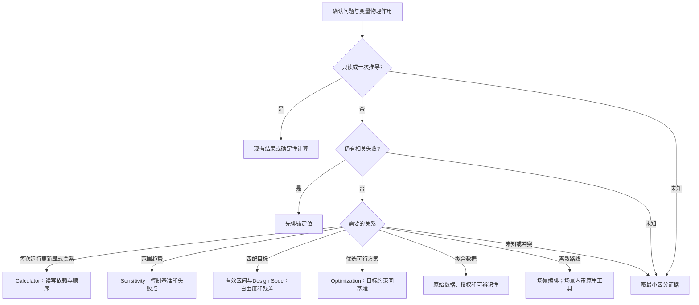

# 按证据选择下一步

本页导航到现有规则，不是新的工艺判定器或验收器。只读当前任务需要的一棵树。
分支依据当前要求、原始结果及相应专业owner，不能由关键词、文件名或自评代替。
每个判断保留三种结果：**有证据成立、有证据不成立、未知/冲突**。
未知不按“否”走默认分支；先取得能区分分支的最小证据，继续不依赖它的工作。

## 1. 任务范围

| 当前要求 | 下一步 | 边界/未知出口 |
|---|---|---|
| 解释原理或比较公开方法 | 读取有关原理/来源后说明 | 不自动启动软件或扩为建厂 |
| 读取已有数值 | 同案有效结果或只读节点，附身份、单位和新鲜度 | 新鲜度未知限定读值结论，不自动求解 |
| 一次代数或换算 | 按[推导阶梯](REASONING_PROTOCOL.md)处理 | 只暂停依赖不可推导输入的量 |
| 仅含组分的模板 | [模板Skill](../../aspen-plus-template/SKILL.md) | 核组分身份，不添生产流程 |
| 创建/修改/求解流程 | 选文档流程、专业岛或修复owner，操作层实现合同 | 路线/允许修改未知则保留具体缺口，不猜工程默认值 |
| 设备、成本或动力学文档 | [资产登记](ACTIVE_ASSET_REGISTRY.md)中对应专业入口 | 不因出现Aspen或设备词语强制全流程/SW6操作 |

主专业owner接回辅助产物；协作Skill负责分派与隔离。比较实际义务、行动和结果，
允许合理等价路径，不以唯一模块名称、固定读取顺序或“已读”声明计分。

## 2. 原生研究工具

此树索引[统一原生工具规则](../../aspen-document-driven-flowsheet/references/aspen_builtin_solve_fit_tools.md)，
条件与例外仍由该owner维护。已有`solve_route`返回行动，不创建、执行或验收对象。

先分清固定操作设置看响应，还是维持相同产品目标后比较。后者需要适用的授权控制，
也可能自然满足目标；不为了填字段虚构控制器。前者不能偷偷开启内层寻优。
对象存在、执行完成、控制关系生效分别验证。单位、Active状态、初始化与保存行为，
按目标版本实际帮助、节点和导出核对，不将另一版本教程经验升为通用规则。

## 3. 排错分支

调用[修复Skill](../../aspen-flowsheet-error-repair/SKILL.md)和
[操作图](../../aspen-plus-operations/references/operation_graph.md)的现行方法。

| 区分证据 | 分支 | 下一步 |
|---|---|---|
| 自有worker阶段、COM/许可证/打开结果 | 启动或资源 | 处理本次资源，增加流程MAXIT不解决启动问题 |
| 当前Required Input、卡片、节点/单位 | 输入或接口 | 修具体字段并回读，再判断是否需要求解 |
| 最新历史/控制面板、最后序列、残差 | 模型或收敛 | 找相关失效依赖，检验一个有据假设并同案复跑 |
| 原始运行证据完整但产品/守恒/设备门不满足 | 工程可行性 | 返回专业owner，不改评分器、目标或日志以消错 |
| 陈旧输出、身份矛盾、汇总或历史缺失 | 证据 | 补相应当前证据，不填零，也不直接判物理失败 |

只有外层症状时保留待区分假设，选最小有效查询，不按表猜根因。旧错误若已被当前结果清除，
保留历史标签；严格验收仍按整次适用证据。复跑遵守当前期限和重试边界，频次只调整检查优先级。

## 4. 设备反馈

规则归[工艺—设备反馈](PROCESS_EQUIPMENT_FEEDBACK.md)，公式/标准归原设备后台。

1. 核设备输入与当前候选身份；不一致先连接正确版本并标记陈旧输出。
2. 区分缺工况/几何、目录无覆盖、已有来源证明能力上限；未知先补最小证据。
3. 有真实约束时，工艺owner按允许修改比较有据调整。目录没型号不直接推出并联/分级。
4. 修改落实到当前模型，复算受影响物流、回路、设备及所需成本；旧结果失效后接回新版。
5. 当前任务内修正按合同继续，不等待跨任务经验学习的关闭门。

设备候选、软件计算、真实设备验收与流程交付分别判断；费用不替代可行性，HeatX结果不替代真实EDR。

## 5. 经验维护

本树只导航[进化流程](EVOLUTION_LOOP.md)、[蒸馏流程](KNOWLEDGE_DISTILLATION_PIPELINE.md)
及[严格准入](STRICT_ACCEPTANCE_AND_LEARNING.md)，不重写其资格/质量判据。

| 判断 | 路径 |
|---|---|
| 明确的代码修复/外部来源维护 | 直接维护及来源审查，不伪造无关任务关闭 |
| 尚未关闭任务的表现或纠正 | 修当前任务，留项目审计，尚不进入共享经验候选 |
| 已确认例外分支或后代 | 仅项目审计；摘要、负例、反思和复跑不改变谱系 |
| 满足各自准入路径 | 先检索已有项；保留原回执，审适用范围和冲突 |
| 相同结论，无可复用增量 | `no_change` |
| 同义且适用条件一致 | `merge`候选，保留来源/消费者 |
| 仅在更窄范围成立 | `specialize`候选，不覆盖一般规则 |
| 新证据与旧规则冲突 | 先核权威；有据才提`replace`或`retract`候选 |
| 明确未覆盖任务或方法 | `add`候选，注明输入、产物和验证 |
| 同条件已被否决，无新证据 | 复用否决原因；范围、版本或来源改变后再重开 |

动作建议不等于准入、质量通过或正式采用。开发/选择/最终审计材料分开；候选不修改自己的评价器或容差。
单候选比较可靠后才按固定预算扩大候选数量。标题、长度、关键词或次数不替代实际行为与工程判据。

## 维护依据与验证

改分支时核：证据来源、未知/冲突出口、唯一主写入者、现有owner及真实产物。
行为比较看实际行动；离线替身、正确拒绝、真实软件运行分开。导航结构通过不证明代理行为改进。

借鉴[superpowers排错流程](https://github.com/obra/superpowers/blob/b36e0829c6d0140e93cfef2ca599b1b07d4a7797/skills/systematic-debugging/SKILL.md)
的假设与验证分工、[AutoSkill](https://github.com/ECNU-ICALK/AutoSkill)的先检索再分类修改，
以及[SkillOpt比较循环](https://github.com/microsoft/SkillOpt/blob/79124b37e9a6371e13b753f8bcd7adb1e493ade1/docs/guide/training-loop.md)
的有界候选和失败记录。保持本库已有工程硬门，不移植文字评分或异常默认放行。
这是直接来源维护的组织方法，不提供新的化工参数或本机提升成绩。
